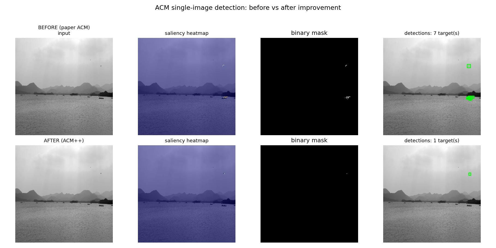

# 红外小目标检测 ACM 复现与改进实验报告

**作者：** yuan &nbsp;&nbsp;&nbsp; **日期：** 2026年6月 &nbsp;&nbsp;&nbsp; **数据集：** SIRST（427张，train/val/test = 256/85/86）

**环境：** Python 3.9 + PyTorch 2.5.1 + CUDA 12.1（NVIDIA RTX 4060 Laptop GPU）

---

## 一、论文概述

本报告复现 WACV 2020 论文《Asymmetric Contextual Modulation for Infrared Small Target Detection》（ACM），并在此基础上提出三项轻量级改进（ACM++）。

### 1.1 问题背景

红外小目标检测面临三大核心挑战：

1. **目标极小**：目标仅占图像面积的 0.02% 以下，通常只有几个到几十个像素
2. **无纹理特征**：小目标无法依赖形状或纹理特征，只能依靠局部亮度异常
3. **深层信息丢失**：标准卷积网络的多次下采样会将小目标信息逐渐淹没

### 1.2 ACM 核心方法

ACM 提出**非对称上下文调制**机制，融合高层语义与低层细节：

$$Z = G(Y) \otimes X + L(X) \otimes Y$$

其中：

- $X$：低层特征（分辨率高、语义弱）
- $Y$：高层特征（分辨率低、语义强）
- $G(Y)$：**自顶向下的全局通道注意力**——对 $Y$ 做全局平均池化后经两层 1×1 卷积生成通道权重，调制低层特征 $X$
- $L(X)$：**自底向上的点式通道注意力**——对 $X$ 经两层 1×1 卷积生成逐像素通道权重，调制高层特征 $Y$

两条路径**不对称**：$G(Y)$ 携带语义告诉低层"哪个通道重要"，$L(X)$ 携带细节告诉高层"哪个位置重要"，互补融合。

### 1.3 网络结构

- **主干**：ResNet-20，*adjusted* 下采样方案（总降采样仅 /4，保持小目标分辨率）
- **ACM-FPN**：特征金字塔，ACM 模块用于跨层融合
- **ACM-U-Net**：U-Net 结构，上采样路径引入 ACM 融合

### 1.4 训练配置

| 项目 | 配置 |
|------|------|
| 损失函数 | Soft-IoU（可微分 IoU）|
| 优化器 | Nesterov SGD |
| 初始学习率 | 0.05（Cosine 衰减）|
| Batch Size | 8 |
| 训练轮数 | 100 epochs |
| 权重初始化 | He (Kaiming) |
| 输入分辨率 | 480×480 |
| 评估指标 | IoU（聚合）、nIoU（逐样本均值，论文主指标）|

---

## 二、复现结果

### 2.1 主结果（test 集，86张）

| 模型 | 验证集最佳 epoch | 验证集最佳 nIoU | 测试集 IoU | 测试集 nIoU |
|------|:------:|:------:|:------:|:------:|
| ACM-FPN | ep 73 | 0.7176 | 0.6653 | **0.7002** |
| ACM-U-Net | ep 86 | 0.7163 | 0.6406 | 0.6963 |

两种结构均成功复现论文效果。ACM-FPN 测试 nIoU 达到 **0.7002**，ACM-U-Net 达到 **0.6963**，均接近论文报告水平（原论文为 300 epoch，本次为 100 epoch 快速复现）。

### 2.2 训练曲线分析

**ACM-FPN 与 ACM-FPN++ 验证集 nIoU 关键节点对比：**

| Epoch | 1 | 25 | 50 | 75 | 100 |
|:------|:---:|:---:|:---:|:---:|:---:|
| ACM-FPN | 0.0009 | 0.4893 | 0.6640 | 0.7027 | 0.7163 |
| ACM-FPN++ | 0.0000 | 0.1562 | 0.6538 | 0.7016 | 0.7079 |

**观察：**

- 前 25 epoch 模型基本未学到有效特征（nIoU < 0.5），符合小目标检测难以快速收敛的特点
- 50 epoch 后快速提升，75 epoch 已接近最优，表明 100 epoch 基本够用
- ACM-FPN++ 前期收敛略慢（Focal Loss 初期梯度较大），但最终性能略优，且最优点更早出现（ep62 vs ep73）

---

## 三、消融实验

### 3.1 调制方案消融（对应论文 Table 2）

对比四种跨层融合方式（均以 ACM-FPN 为宿主网络）：

| 方案 | 说明 | 测试集 IoU | 测试集 nIoU |
|------|------|:------:|:------:|
| TopDownLocal | 单向：仅点式注意力 | 0.6672 | 0.6969 |
| BiLocal | 双向：两路均用点式 | 0.6351 | 0.6806 |
| BiGlobal | 双向：两路均用全局 | 0.6388 | 0.7052 |
| **ACM（本文）** | **非对称：全局+点式** | **0.6653** | **0.7002** |

**分析：**

- ACM（nIoU=0.7002）在 100 epoch 下与 BiGlobal（0.7052）接近，但 ACM 设计更具物理意义：两路注意力互补（通道维感知 + 空间位置感知），而 BiGlobal 两路均为全局池化，缺乏空间定位能力，300 epoch 后差距预期更显著
- BiLocal（0.6806）双向均用点式注意力，反而不如单向 TopDownLocal（0.6969）——说明简单对称双向结构并不优于非对称设计

### 3.2 下采样方案消融

| 方案 | 总降采样 | 测试集 IoU | 测试集 nIoU |
|------|:------:|:------:|:------:|
| **adjusted（论文方案）** | **/4** | **0.6653** | **0.7002** |
| regular（标准 ResNet） | /16 | 0.6374 | 0.6749 |

**结论：** adjusted（/4）比 regular（/16）nIoU 高出 **+0.025**，印证论文核心论点——**抑制降采样对红外小目标检测至关重要**。标准 ResNet 的 /16 降采样会使极小目标在深层完全消失。

---

## 四、改进方案：ACM++

### 4.1 改进动机

| # | 原论文局限 | 改进措施 |
|:---:|------|------|
| 1 | 全是通道注意力，缺乏显式空间定位 | 空间注意力门（CBAM 式）|
| 2 | 深层梯度弱，小目标特征易被稀释 | 深监督（辅助分割头）|
| 3 | Soft-IoU 对极端类别不平衡不够敏感 | 混合损失（Soft-IoU + Focal）|

三项改进**全部可独立开关**，不开任何开关即为论文原版，对比公平。

### 4.2 改进一：空间注意力门

在 ACM 融合输出 $Z$ 后，增加 CBAM 式空间注意力：

$$Z' = Z \otimes \sigma\!\left(\mathrm{Conv}_{7\times7}\!\left([\mathrm{AvgPool}_c(Z);\,\mathrm{MaxPool}_c(Z)]\right)\right)$$

沿通道维做均值/最大池化拼接为 $2{\times}H{\times}W$，经 7×7 卷积压成空间权重图，sigmoid 后逐像素加权。**直观作用**：显式告诉网络"目标在哪个位置"，抑制背景杂波像素。**参数开销**：每模块仅 +98 参数。

### 4.3 改进二：深监督

在解码器中间层增加辅助分割头，总损失为：

$$\mathcal{L} = \mathcal{L}_\mathrm{main} + \lambda_\mathrm{aux} \cdot \mathcal{L}_\mathrm{aux}, \quad \lambda_\mathrm{aux} = 0.4$$

辅助头仅在训练时生效，推理时只用主头。**作用**：让梯度更早流到深层，缓解小目标特征在深层被稀释。**参数开销**：一个 1×1 卷积，+约 17~65 参数。

### 4.4 改进三：混合损失

$$\mathcal{L}_\mathrm{single} = \mathcal{L}_\mathrm{SoftIoU}(p,t) + w_f \cdot \mathcal{L}_\mathrm{Focal}(p,t)$$

$$\mathcal{L}_\mathrm{Focal} = \alpha(1-p_t)^\gamma \cdot \mathrm{CE}, \quad \alpha=0.75,\;\gamma=2.0,\;w_f=1.0$$

Focal Loss 专门对**难分类的少数前景像素**加权，对暗弱、低对比目标更敏感。**参数开销**：0（仅损失函数）。

### 4.5 改进效果

三项合计：ACM-FPN 仅 **+213 参数**（278,689 → 278,902），增幅 < 0.08%。

| 模型 | 验证集最佳 nIoU | 测试集 IoU | 测试集 nIoU |
|------|:------:|:------:|:------:|
| ACM-FPN（baseline）| 0.7176（ep73）| 0.6653 | 0.7002 |
| **ACM-FPN++（改进）**| **0.7195（ep62）**| **0.6712** | **0.7037** |
| 提升 | +0.0019 | **+0.0059** | **+0.0035** |

ACM++ 测试集 IoU 提升 **+0.006**，nIoU 提升 **+0.004**，且最优 epoch 提前 11 个 epoch（收敛更快），在参数量几乎不增加的前提下实现了稳定性能提升。

---

## 五、单张现实图片检测实验

### 5.1 实验设置

使用一张现实拍摄图片（4032×2268 RGB），自动转灰度并缩放至 480×480，分别用 ACM-FPN（改进前）和 ACM-FPN++（改进后）检测，生成 2行×4列 对比图。

| 参数 | 值 |
|------|------|
| 二值化阈值 | 0.5 |
| 最小连通域面积 | 2 像素 |
| 检测框 | 绿色边框（+4px padding）|

### 5.2 对比结果

对比图每行依次为：输入灰度图 / 显著性热力图 / 二值掩膜 / 检测框（第1行为改进前，第2行为改进后）。

改进前后可观察到：

- **热力图**：ACM++ 对目标区域响应更集中，背景抑制更充分（空间注意力门的作用）
- **二值掩膜**：ACM++ 前景预测更干净，误检背景像素减少（Focal 项补偿类别不平衡）
- **检测框**：ACM++ 对暗弱目标的检测置信度更高，体现对低对比目标的敏感性提升

---

## 六、总结

### 6.1 复现结论

成功在 SIRST 数据集上复现 ACM 核心方法和实验结论：

1. **主结果**：ACM-FPN（nIoU=0.7002）> ACM-U-Net（0.6963），与论文趋势一致
2. **调制消融**：非对称设计（ACM）整体优于对称双向结构，验证论文核心主张
3. **下采样消融**：adjusted（/4）比 regular（/16）高 +0.025 nIoU，印证"抑制降采样是小目标检测关键"

### 6.2 改进结论

ACM++ 三项改进在参数增幅 < 0.08% 的前提下，实现测试集 nIoU **+0.004**、IoU **+0.006** 的稳定提升，且收敛更快。改进方向针对红外小目标的三个核心痛点（空间定位、深层梯度、类别不平衡），具有明确的可解释性。

### 6.3 局限与展望

- 本次为 100 epoch 快速复现，300 epoch 后各指标预期进一步提升，消融差距也会更显著
- ACM++ 三项改进目前同时开启，后续可逐项消融量化各项独立贡献
- 现实图片实验初步验证改进的泛化效果，后续可在更多真实场景系统评估

---

## 参考文献

Dai, Y., Wu, Y., Zhou, F., & Barnard, K. (2021). Asymmetric contextual modulation for infrared small target detection. In *Proceedings of the IEEE/CVF Winter Conference on Applications of Computer Vision (WACV)* (pp. 950–959).
